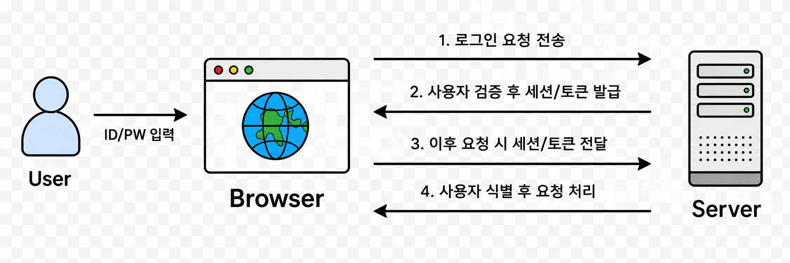

## 인증(Authentication)

- 정의 : 컴퓨터 시스템, 네트워크 또는 데이터에 액세스하려는 사용자, 기기, 애플리케이션의 신원을 검증하여 안전성을 보장하는 프로세스(Authentication)입니다.
- 시스템에 접근하려는 사용자가 주장하는 신원(ID)이 실제 본인이 맞는지를 확인하는 프로세스
- 인증과 인가의 차이
	- 인증은 사용자가 '누구인지' 확인하는 신원 증명 과정
	- 인가는 인증된 사용자가 '무엇을 할 수 있는지' 권한을 허가하는 과정
	- 인증이 먼저 발생하여 사용자 정체성을 확보한 후, 인가 단계에서 접근 권한을 결정한다.

### 인증 요소

1. 지식 기반 인증 : 사용자가 알고 있는 정보
	- 예 : Password, PIN, 보안 질문
2. 소유 기반 인증 : 사용자가 소유한 기기 / 물건
	- OTP, SMS 인증번호, 스마트 카드, 보안 토큰
3. 생체 기반 인증 : 신체적 특징
	- 지문, 홍채, 얼굴 인식, 목소리
4. 행위 기반 인증 : 사용자의 고유 행동 패턴
	- 서명, 걸음 걸이

### 인증 방식

1. SFA(Single-Factor-Authentication) : 단일 요소 인증
	- ID / PW 하나만 사용하는 방식
2. 2FA(Two-Factor-Authentication) : 2가지 서로 다른 인증 요소를 결합
	- 비밀번호 + OTP, 비밀번호 PIN 등 2가지의 인증 방식을 사용
3. MFA(Multi-Factor-Authentication) : 2개 이상의 서로 다은 요소를 조합
	- 비밀번호 + OTP + 지문 인증 등 2가지 이상의 인증 요소를 사용하는 경우
	- 일반적으로는 2FA도 MFA 포함시키지만 좁은 의미로는 3개 이상을 의미할때 사용

### 웹 서비스에서의 인증 흐름

### 주요 인증 수단 및 기술
1. ID/PW 로그인
	- 사용자가 ID와 PW를 입력하여 본인임을 증명하는 가장 기본적인 인증 방식
	- 서버는 입력된 ID/PW를 DB에 저장된 계정 정보와 비교하여 인증 성공 여부를 판단
	- 안전을 위해 비밀번호는 평문으로 저장하지 않고, 보통 Hash 처리된 값과 비교
	- 인증에 성공하면 이후 요청을 식별하기 위해 세션 또는 토큰을 발급하는 과정으로 이동
2. 세션 기반 인증
	- 사용자가 로그인에 성공하면 서버가 세션(Session)을 생성하고, 클라이언트에는 세션 ID를 쿠키로 전달하는 방식
	- 사용자가 요청을 보낼 때 브라우저는 쿠키에 저장된 세션 ID를 함께 전송
	- 서버는 전달받은 세션 ID를 이용해 서버에 저장된 세션 정보를 조회하고, 사용자가 인증된 상태인지 확인
	- 세션 정보가 서버에 저장되기 때문에 서버 측에서 강제 로그아웃, 세션 만료, 권한 변경 등을 관리하기 쉬움
	- 단점으로는 사용자가 많아질수록 서버의 세션 저장소 관리 부담이 증가
3. 토큰 기반 인증
	- 사용자가 로그인에 성공하면 서버가 Access Token 같은 인증 토큰을 발급하고, 클라이언트가 이후 요청에 해당 토큰을 포함하여 보내는 방식
	- 보통 API 요청 시 `Authorization: Bearer <token>` 형태로 헤더에 포함
	- 서버는 전달받은 토큰을 검증하여 사용자의 인증 상태와 권한 정보를 확인
	- JWT 같은 토큰은 토큰 자체에 사용자 식별 정보, 만료 시간, 권한 정보 등을 포함할 수 있음.
	- 서버가 세션을 직접 저장하지 않아도 되는 구조로 만들 수 있어 API 서버, 모바일 앱, SPA 환경에서 자주 사용
	- 단, 토큰이 탈취되면 만료 전까지 악용될 수 있으므로 짧은 만료 시간, Refresh Token, HTTPS 사용, 안전한 저장 방식이 중요
4. API Key 인증
	- API 요청 시 고유한 키를 헤더나 쿼리 파라미터 등에 포함하여 요청 주체를 식별하는 방식
	- 예를 들어 `X-API-Key: <api_key>` 같은 형태로 요청에 포함할 수 있음.
	- 주로 외부 서비스 연동, 서버 간 통신, 개발자용 API 호출에서 사용
	- API Key는 “어떤 사용자 개인이 로그인했는지”보다는 “어떤 애플리케이션 또는 클라이언트가 요청했는지”를 식별하는 성격
	- 단독으로 강한 사용자 인증 수단으로 사용하기보다는 요청 제한, 서비스 식별, 접근 제어와 함께 사용하는 경우가 많음.
	- 키가 노출되면 누구나 해당 권한으로 API를 호출할 수 있으므로, 키 보관, 주기적 교체, 권한 범위 제한, IP 제한 등이 필요
5. SSO (Single Sign-On)
	- 한 번의 로그인으로 여러 서비스나 시스템에 접근할 수 있도록 하는 인증 방식
	- 사용자는 중앙 인증 서버 또는 외부 인증 제공자에서 로그인하고, 각 서비스는 해당 인증 결과를 신뢰하여 접근을 허용
	- 예를 들어 Google 계정으로 여러 서비스에 로그인하거나, 회사 계정으로 사내 여러 시스템에 접근하는 방식이 SSO에 해당
	- SAML, OAuth 2.0, OpenID Connect 같은 표준 프로토콜이 자주 사용
	- 사용자는 여러 서비스마다 ID/PW를 따로 입력하지 않아도 되어 편리하고, 조직 입장에서는 계정 관리와 접근 제어를 중앙에서 관리하기 쉬움
	- 단, 중앙 인증 계정이 탈취되면 연결된 여러 서비스에 영향을 줄 수 있으므로 MFA, 세션 관리, 접근 로그 모니터링이 중요
6. 공동인증서
	- 공동인증서는 사용자의 신원을 전자적으로 증명하기 위해 사용하는 인증 수단
	- 과거에는 공인인증서라고 불렸으며, 현재는 공동인증서라는 명칭으로 사용
	- 사용자는 인증서 파일과 인증서 비밀번호를 이용하여 본인임을 증명
	- 주로 금융 서비스, 공공기관, 전자서명, 본인확인 등의 환경에서 사용
	- 공동인증서는 공개키 기반 구조(PKI, Public Key Infrastructure)를 사용
	- 인증서 저장 위치 관리, 비밀번호 관리, 악성코드 감염 방지, 안전한 기기 사용이 중요

### 주요 인증 표준 및 프로토콜

1. FIDO(Fast IDentity Online)
	- 비밀번호 의존도를 줄이고, 공개키 암호화 기반으로 안전한 인증을 제공하기 위한 국제 인증 표준 프레임워크
	- 사용자의 비밀번호를 서버에 직접 저장하거나 전송하지 않고, 사용자 기기 내 인증 장치와 공개키/개인키 쌍을 이용하여 인증
	- 지문, 얼굴 인식, PIN, 보안 키 등 다양한 인증 수단을 사용
	- 피싱 사이트에서는 정상 도메인과 매칭되는 인증 정보가 없기 때문에 피싱 공격에 강한 편
	- FIDO는 크게 기존 FIDO UAF/U2F 계열과, 최신 FIDO2 계열로 구분
	- 대표적인 예시로는 모바일 앱에서 지문이나 얼굴 인식을 통해 사용자를 확인하는 방식, 보안 키를 이용한 2단계 인증, 패스키를 이용한 웹 로그인 등이 있음
	1. UAF(Universal Authentication Framework)
		- 지문, 얼굴 인식 등 사용자의 생체 정보나 로컬 인증 수단을 이용해 비밀번호 없이 인증하는 방식
		- 사용자의 생체 정보 자체가 서버로 전송되는 것이 아니라, 기기 내부에서 사용자를 확인한 뒤 암호학적 인증 결과를 서버에 전달
		- 모바일 환경의 비밀번호 없는 인증에 자주 사용되는 개념
	2. U2F(Universal 2nd Factor) / CTAP1
		- ID/PW 로그인 이후 추가 인증 요소로 보안 키를 사용하는 2단계 인증 방식
		- 사용자는 먼저 ID/PW로 로그인하고, 이후 USB, NFC, BLE 등을 통해 연결된 FIDO 보안 키로 추가 인증을 수행
		- 비밀번호가 탈취되어도 물리적인 보안 키가 없으면 로그인이 어렵기 때문에 계정 탈취 방어에 효과적
		- 현재 FIDO2에서는 기존 U2F를 CTAP1이라는 이름으로 호환 지원
		- 예) 암호화폐 거래소 계정에서 ID/PW 로그인 후 YubiKey 같은 FIDO 보안 키를 터치하여 2차 인증을 수행하는 방식
		- 예) 암호화폐 거래소에서 출금, 보안 설정 변경 등 민감한 작업을 할 때 FIDO 보안 키 인증을 추가로 요구하는 방식
	3. FIDO2
		- WebAuthn과 CTAP를 기반으로 하는 최신 FIDO 표준
		- 웹 브라우저, 운영체제, 보안 키, 생체 인증 장치 등을 이용해 비밀번호 없는 인증 또는 강한 2단계 인증을 구현할 수 있음
		- 대표적으로 패스키(passkey), WebAuthn 기반 웹 로그인, 보안 키 로그인, 생체 인증 기반 웹 로그인 등에 사용
		- 사용자는 웹사이트나 앱에서 비밀번호 대신 지문, 얼굴 인식, PIN, 보안 키 등을 이용해 로그인할 수 있음
		- 이때 지문이나 얼굴 정보 자체가 웹사이트 서버로 전송되는 것이 아니라, 기기 내부에서 사용자를 확인한 뒤 공개키 암호화 기반의 인증 결과만 서버에 전달됨
		- 예) Google 계정에서 패스키를 등록한 뒤 스마트폰 지문이나 화면 잠금으로 로그인하는 방식
		- 예) 웹사이트에서 “패스키로 로그인”, “보안 키로 로그인”, “지문으로 로그인” 같은 기능을 제공하는 경우
2. WebAuthn(Web Authentication)
	- 웹 서비스에서 FIDO 인증을 사용할 수 있도록 만든 W3C 표준 웹 API
	- 웹 브라우저와 웹 애플리케이션이 사용자의 인증 장치와 상호작용하여 공개키 기반 인증을 수행
	- 서버는 사용자의 공개키를 저장하고, 사용자의 개인키는 사용자의 기기 또는 보안 키 내부에 안전하게 보관
	- 로그인 시 서버가 Challenge 값을 보내면, 사용자의 인증 장치가 개인키로 서명하고 서버는 저장된 공개키로 이를 검증
	- 비밀번호가 직접 전송되지 않기 때문에 비밀번호 재사용, 비밀번호 유출, 피싱 공격에 강한 구조
	- 패스키(passkey), 생체 인증 기반 로그인, 보안 키 로그인 등을 구현할 때 사용
	- WebAuthn은 단독 기술이라기보다 FIDO2를 웹 환경에서 사용할 수 있게 해주는 핵심 구성 요소로 보는것이 좋음.
3. OAuth 2.0
	- 사용자의 비밀번호를 직접 공유하지 않고, 제3자 애플리케이션이 사용자의 자원에 제한적으로 접근할 수 있도록 권한을 위임하는 인가 표준 프로토콜
	- 
4. OpenID Connect(OIDC)
	- 

---
## 인가(Authorization)

- 사용자, 시스템, 서비스 등이 특정 자원(데이터, 파일, 기능, API 등)에 접근하거나 작업을 수행할 권한이 있는지 확인하고, 허가 또는 거부하는 프로세스입니다.
- 인증(Authentication)이 “누구인지 확인하는 과정”이라면, 인가(Authorization)는 “무엇을 할 수 있는지 결정하는 과정”입니다.
- 인증에 성공한 사용자라도 권한이 없는 자원이나 기능에는 접근할 수 없도록 제한하는 핵심 보안 단계입니다.

### 인가의 기능

1. 접근 제어(Access Control)
	- 사용자가 인증(Authentication)을 마친 후 특정 데이터, API, 파일, 관리자 페이지 등에 접근할 수 있는지 권한을 확인합니다.
	- 예) 로그인한 사용자가 관리자 페이지에 접근하려 할 때 관리자 권한이 있는지 확인합니다.
2. 권한 허가/거부
	- 사용자 ID, 역할(Role), 권한(Permission), 세션, 토큰(JWT) 등을 기반으로 허용된 작업(읽기, 쓰기, 수정, 삭제 등)만 수행하도록 제한합니다.
	- 예) 일반 사용자는 게시글 조회만 가능하고, 작성자나 관리자는 수정/삭제가 가능하도록 제한합니다.
3. 보안 및 리소스 보호
	- 인증된 사용자라도 권한이 없는 중요 데이터나 기능에는 접근하지 못하게 하여 시스템 보안을 유지합니다.
	- 예) 관리자 권한은 주요 관리 페이지에 접근할 수 있고, 일반 사용자 권한은 일반 기능만 사용할 수 있습니다.

